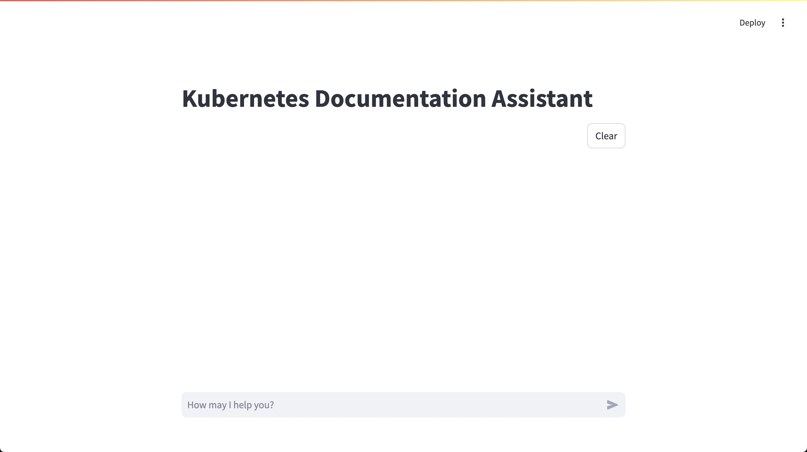

# Kumi: Kubernetes Documentation Assistant with RAG

<p align="center"></p>

## Introduction

**Kumi** is a documentation assistant designed to help you efficiently explore and understand Kubernetes documentation using RAG (Retrieval-Augmented Generation) technology.
With approximately 800 official Kubernetes documents, finding the right information can be time-consuming and challenging.
Kumi was developed to address this issue.

As of August 2024, [the Kubernetes official documentation](https://kubernetes.io/docs) consists of various subdomains, each containing a different number of documents.
Below is a breakdown of the structure and the number of documents available in each subdomain:

- [concepts](https://kubernetes.io/docs/concepts): 154 documents
- [contribute](https://kubernetes.io/docs/contribute): 33 documents
- [home](https://kubernetes.io/docs/home): 1 documents
- [reference](https://kubernetes.io/docs/reference): 361 documents
- [setup](https://kubernetes.io/docs/setup): 24 documents
- [tasks](https://kubernetes.io/docs/tasks): 209 documents
- [test](https://kubernetes.io/docs/test): 1 documents
- [tutorials](https://kubernetes.io/docs/tutorials): 45 documents

Given the vast amount of documentation, using RAG offers several benefits to make navigating and understanding these documents more efficient:

- **Up-to-date Information**: Kumi provides highly accurate and reliable responses using the latest Kubernetes document data.
- **Efficiency**: Kumi significantly reduces the time required to find relevant information, offering quick and precise responses to your queries.
- **Scalability**: Kumi enhances access to a broad range of Kubernetes documentation, supporting a deeper technical understanding.

**Currently, Kumi's responses include some Korean, so asking questions in Korean is recommended for the best results.**

## How It Works

Kumi operates through two main processes:

### Vector DB Setup

1. **Data Collection**: All Kubernetes documents are crawled to collect document data.
2. **Embedding**: The collected document data is embedded using an Embedding model and stored in a Vector DB.

### Real-time Chat

1. **Processing User Input**: When a user inputs a query, it is embedded using the Embedding model.
2. **Relevant Document Search**: The system searches the Vector DB for the most relevant content based on the user's input.
3. **Answer Generation**: Using the retrieved content, a Completion model generates an optimal response for the user.

## Installation

Follow the commands below to install and use this repository:

```bash
# For general users
$ make setup

# For developers
$ make setup-dev
```

## Prerequisites

To set up the Vector DB and enable Real-time Chat, you'll need an OpenAI API Key.

Generate an API Key from [OpenAI API Key](https://platform.openai.com/api-keys).

Create a `.env` file in this repository and enter the following line with your API Key:

```env
OPENAI_API_KEY=xxxxx
```

## How To Chat

### 1. Vector DB Setup

To set up the Vector DB, check the following three variables in the [Vector DB main module](src/vector_db/main.py).

```python
TARGET_SUBDOMAINS = ["home", "setup", "test"]

EMBEDDING_MODEL = "text-embedding-3-large"
EMBEDDING_MAX_TOKENS = 8192
```

- **Target subdomains**: The full list of subdomains includes `["concepts", "contribute", "home", "reference", "setup", "tasks", "test", "tutorials"]`. By default, only `["home", "setup", "test"]` are selected to reduce the number of documents being embedded, as including all subdomains would result in approximately 800 documents and could lead to higher costs. Modify the list to include your desired subdomains based on your needs. **Note: Adding more subdomains may increase the API usage costs.**
- **Embedding Model**: Refer to the [OpenAI Embeddings](https://platform.openai.com/docs/guides/embeddings/embedding-models) and specify the embedding model you want to use.
- **Embedding Max Tokens**: Check the [OpenAI Embeddings](https://platform.openai.com/docs/guides/embeddings/embedding-models) to find the maximum tokens for the chosen embedding model. Generally, it is the number listed under max input plus one.

**Ensure you save your changes to the code after modifying these variables.**

### 2. API Setup

In the [API main module](src/api/main.py), ensure you check the following four variables:

```python
EMBEDDING_MODEL = "text-embedding-3-large"
EMBEDDING_MAX_TOKENS = 8192
COMPLETION_MODEL = "gpt-4o-mini"
COMPLETION_CONTEXT_WINDOW = 128000
```

- **Embedding Model**: Same as in the Vector DB Setup.
- **Embedding Max Tokens**: Same as in the Vector DB Setup.
- **Completion Model**: Refer to the [OpenAI Models](https://platform.openai.com/docs/models) to choose your preferred Chat Completion model.
- **Completion Context Window**: Refer to the [OpenAI Models](https://platform.openai.com/docs/models) to find the context window for the selected model.

### 3. Real-time Chat with Kumi

To start a chat session with Kumi, enter the following command:

```bash
$ make chat
```

To end the chat session with Kumi, use the following command:

```bash
$ make chat-end
```

Then, open your web browser and go to `localhost:9000` to start chatting with Kumi!

<p align="center"></p>

Enjoy your conversation with Kumi and happy exploring!

Thank you for using Kumi.
